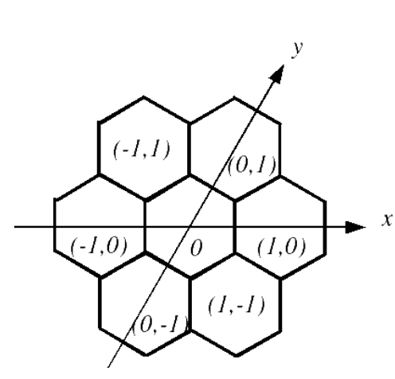
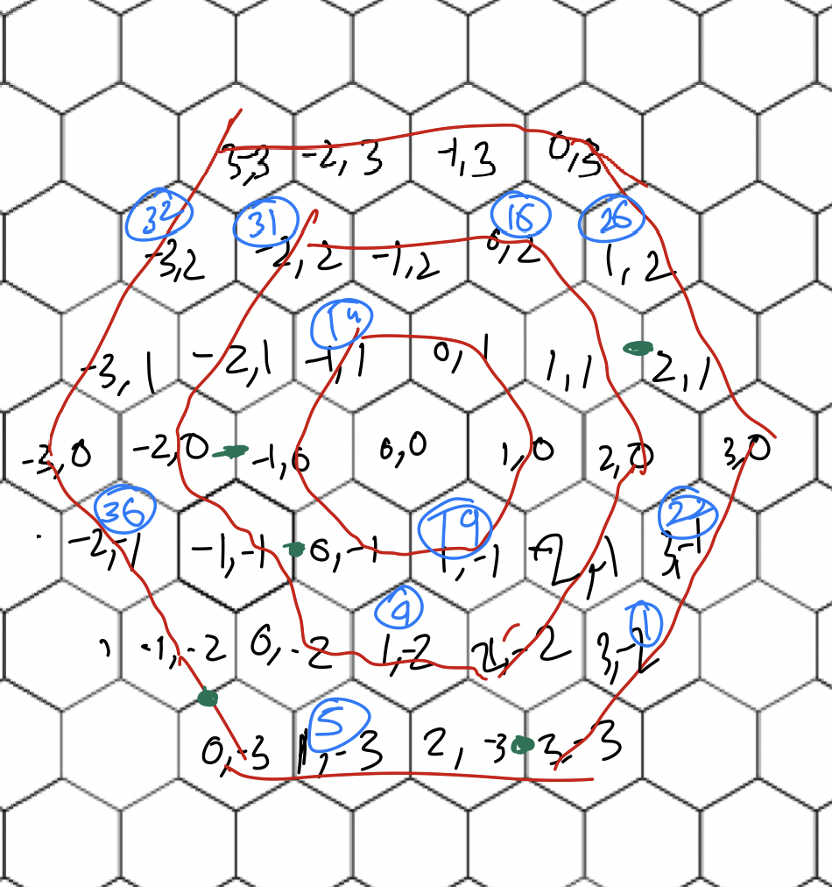

Written in gnu-prolog

If interpreter doesn't load the file, please change name of file and load.

For q2 Co-ordinates used are-



Please restart prolog interpreter after running once.

Query Format: solve(board-size, [links], [pre-filled])

- board-size = 36, 60, 90
- links = list of links, each link is of format [x1,y1,x2,y2]
- pre-filled is array where each element is [x, y, value]

Example-

```bash
| ?- solve(36, [[3,-3,2,-3],[0,-3,-1,-2],[-1,-1,0,-1],[-2,0,-1,0],[1,1,2,1]],[[3,-2,1],[1,-3,5],[1,-2,9],[-1,1,14],[0,2,16],[1,-1,19], [3,-1,22], [1,2,26], [-2,2,31],[-3,2,32], [-2,-1,36]]).
1 at (3, -2)
2 at (2, -2)
3 at (3, -3)
4 at (2, -3)
5 at (1, -3)
6 at (0, -3)
7 at (-1, -2)
8 at (0, -2)
9 at (1, -2)
10 at (0, -1)
11 at (-1, -1)
12 at (-2, 0)
13 at (-1, 0)
14 at (-1, 1)
15 at (-1, 2)
16 at (0, 2)
17 at (0, 1)
18 at (1, 0)
19 at (1, -1)
20 at (2, -1)
21 at (2, 0)
22 at (3, -1)
23 at (3, 0)
24 at (2, 1)
25 at (1, 1)
26 at (1, 2)
27 at (0, 3)
28 at (-1, 3)
29 at (-2, 3)
30 at (-3, 3)
31 at (-2, 2)
32 at (-3, 2)
33 at (-2, 1)
34 at (-3, 1)
35 at (-3, 0)
36 at (-2, -1)
execution aborted
| ?-
```


